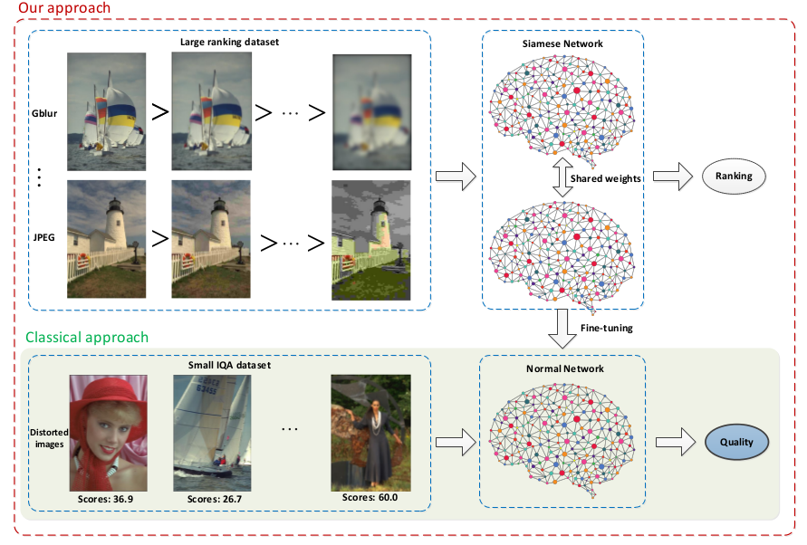

# 无参考图像质量评价

相关资料：
* 知乎上一篇关于无参考图像质量评估的综述：[图像质量评估综述](https://zhuanlan.zhihu.com/p/32553977),
  作者：涂必超，计算机视觉工程师，美图云视觉技术部门。
* [BIAQ](https://github.com/HuiZeng/BIQA_Toolbox)
* [NR-IQA-CNN](https://github.com/Adnan1011/NR-IQA-CNN)
* Google [NIMA](chrome-extension://gfbliohnnapiefjpjlpjnehglfpaknnc/pages/pdf_viewer.html?r=https://arxiv.org/pdf/1709.05424.pdf): 
  可以挑选出具有美感的高质量图像
* 一篇[CSDN](https://blog.csdn.net/yjbkaoyan/article/details/78550148)

## RankIQA
### 简介

参考[RankIQA](https://github.com/xialeiliu/RankIQA)中的方法，将回归问题转化为分类+回归的
问题，对高质量图像进行distortion，生成大量不同等级的图像，先训练一个图像质量rank的网络，
网络结构为Siamese，Siamese内为VGG；在训练完成后，在其基础上进行fine-tuning，使用公开集
数据(大约为2000多张)微调该网络，损失函数为L2，回归图像的具体质量分数。

该方法可以突破无参考图像质量评价的小数据集限制，可以使用大网络来训练而不产生过拟合。

### 文件说明
* ./data: distortion的matlab代码，生成Rank网络需要的不同等级的图像
* src: 为适应人脸大小，将网络输入从224降低到128重新训练
* _src: 原网络代码，输入大小为224
* regression_network: 使用小网络拟合RankIQA的效果
  * train_pose_qua.py: 一个网络同时完成预测人脸角度和图像质量的任务
    * 先使用该网络分别完成单个任务，观察最终loss可以下降到多少，这个值是这个网络性能的极限
    * 防止一个任务的loss被另一个任务影响，需要将两个任务的loss加权，当作反向传播的loss
    * 分别打印出两个任务的loss，观察是否下降到单任务时的最小loss
    * 训练时发现在低质量图像时网络性能很差，对图像的质量label进行非线性拉伸到 0-10，使用的非线性
      拉伸公式为 qua_final = qua**0.4*(10./5.5**0.4) (label中的最大值为5.5)

